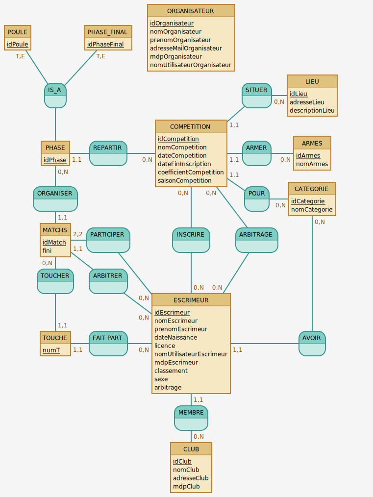

<div style="text-align: center;">

# SAE-3.05

<div style="display: flex; align-items: center; justify-content:space-evenly">
    
    
</div>
</div>

## Membres du groupe

<strong>Le groupe est composé de 5 membres :</strong>

- `CHEDEVILLE Baptiste`
- `FOFANA Abdoulahi`
- `MERIT Juliann`
- `EL KASMI Hajar`
- `BARACHE Yannis`

## Description du projet

Ce projet est le projet de fin de 1ère période de notre deuxième année à l'IUT d'Orléans.
Il consiste à créer une application web de gestion de compétition d'escrime pour le cercle d'escrime de Blois.
Cette application permettra de gérer les compétitions, les inscriptions, les résultats, les classements, etc.
Nous utiliserons le langage python avec le framework flask pour la réalisation de cette application lié à une base de données MySQL distante.

## Installation

Pour installer le projet, il faut tout d'abord cloner le projet sur votre machine dont voici la commande :

```bash
git clone https://github.com/Yannis-barache/SAE-3.05
```

Ensuite, il faut installer les dépendances du projet et mettre en place l'environnement virtuel.
Pour cela, un exécutable vous est mis à disposition nommée setup.sh qui mettra en place toutes les dépendances.
Vous pouvez donc exécuter le script avec la commande suivante :

```bash
./setup.sh
```

Maintenant que tout est installé, il faut rentrer dans l'environnement virtuel avec la commande suivante :

```bash
source venv/bin/activate
```

Vous pouvez donc maintenant lancer l'application avec la commande suivante :

```bash
flask run
```

Et voilà, l'application est lancée et vous pouvez vous y connecter en allant sur l'adresse suivante : http://127.0.0.1:5000/


## Utilisation

L'utilisation du site va dépendre de votre rôle sur le site.

### Organisateur

L'`organisateur` est la personne qui va gérer les compétitions.
Il peut donc créer des compétitions, les modifier, les supprimer, etc.
Il en va de même pour les catégories, les armes, les tireurs, etc.

### Escrimeur

L'`escrimeur` est la personne qui va s'inscrire aux compétitions.
Il peut donc s'inscrire à une compétition, se désinscrire, voir ses résultats, etc.
Il peut également s'inscrire à une compétition en tant qu'arbitre.

### Club

Le `club` est l'entité qui va gérer les escrimeurs.
Il peut donc ajouter des escrimeurs, les modifier, les supprimer, etc.

## Liste des tâches à faire

### Tâches à faire pour le 27/10/2023
- [x] Réaliser le diagramme de cas d'utilisation
- [ ] Réaliser le diagramme de séquence
- [x] Réaliser le MCD (Modèle Conceptuel de Données) de la base de données

### Tâches à faire pour le rendu final
- [ ] Création de la base de données
  - [x] Création de create.sql
  - [x] Création de delete.sql
  - [x] Création d'insert.sql
  - [x] Création des relations
  - [ ] Création des triggers
  - [ ] Création des procédures stockées
  - [ ] Création des fonctions
  
- [ ] Réaliser les maquettes de l'application

<strong>TODO : Ajouter les tâches à faire</strong>


## MCD de la base de données

Après une lecture attentive du sujet, nous avons pu réaliser le MCD suivant :




## Liste des tâches réalisées lors de la première semaine


### Tout le groupe :

En cette première semaine, nous avons tous principalement travaillé sur la réalisation du MCD de la base de données.
Nous nous sommes ensuite répartis les tâches à réaliser pour la première semaine. Ainsi chacun à travailler sur différentes choses individuellement ou en groupe.


### Yannis :

- J'ai travaillé sur la réalisation du diagramme de cas d'utilisation et sur la réalisation du MCD, mais également de son implémentation dans une base de données.
- J'ai donc travaillé sur la création des tables, des relations, des triggers, des procédures stockées et des fonctions.
- J'ai réalisé le script `setup.sh` pour permettre une installation rapide et simple du projet.
- J'ai aussi travaillé sur la réalisation du `README.md` et du rendu.


### Hajar :

TODO : Ajoute ce que tu as fait

### Juliann :

TODO : Ajoute ce que tu as fait

### Abdoulahi :

TODO : Ajoute ce que tu as fait

### Baptiste :

TODO : Ajoute ce que tu as fait

