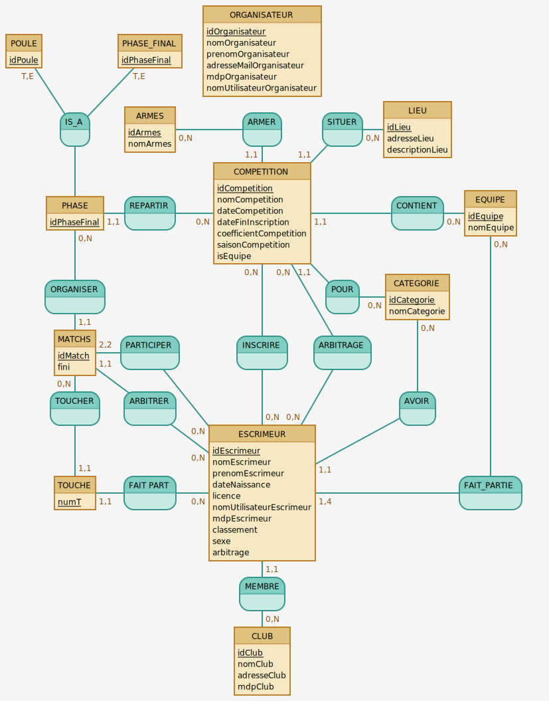

# SAE-3.05


[](https://github.com/pylint-dev/pylint)
[](https://github.com/Yannis-barache/SAE-3.05)

[](https://github.com/Yannis-barache/SAE-3.05/actions)
[](https://github.com/Yannis-barache/SAE-3.05/tags)
[](https://coveralls.io/github/Yannis-barache/SAE-3.05?branch=develop)


<div style="display: flex; align-items: center; justify-content:space-evenly; flex-wrap: nowrap">
    
    
</div>


<div style ="text-align: justify;">

| Sommaire                                                                                                          |
|-------------------------------------------------------------------------------------------------------------------|
| [Membres du groupe](#membres-du-groupe)                                                                           |
| [Description du projet](#description-du-projet)                                                                   |
| [Installation](#installation)                                                                                     |
| [Utilisation](#utilisation)                                                                                       |
| [Liste des tâches à faire](#liste-des-tâches-à-faire)                                                             |
| [MCD de la base de données](#mcd-de-la-base-de-données)                                                           |
| [Diagramme de cas d'utilisation](#diagramme-de-cas-dutilisation)                                                  |
| [Liste des tâches réalisées lors de la première semaine](#liste-des-tâches-réalisées-lors-de-la-première-semaine) |
</div>

## Membres du groupe

<strong>Le groupe est composé de 5 membres :</strong>

[](https://github.com/Baptched)
[](https://github.com/Hajarelkasmi)
[](https://github.com/JuliannMerit)
[](https://github.com/Abdwuu)
[](https://github.com/Yannis-barache)


## Description du projet

Ce projet est le projet de fin de 1ère période de notre deuxième année à l'IUT d'Orléans.
Il consiste à créer une application web de gestion de compétition d'escrime pour le cercle d'escrime de Blois.
Cette application va permettre de gérer des compétitions d'escrime, via celle-ci.
Nous utiliserons le langage python avec le framework flask pour la réalisation de cette application lié à une base de données MySQL distante.

<br><br>

## Installation

Pour installer le projet, il faut tout d'abord cloner le projet sur votre machine dont voici la commande :

```bash
git clone https://github.com/Yannis-barache/SAE-3.05
```

Ensuite, il faut installer les dépendances du projet et mettre en place l'environnement virtuel.
Pour cela, un exécutable vous est mis à disposition nommée setup.sh qui mettra en place toutes les dépendances.
Vous pouvez donc exécuter le script avec la commande suivante :


### Linux

```bash
./setup.sh
```

Maintenant que tout est installé, il faut rentrer dans l'environnement virtuel avec la commande suivante :

```bash
source venv/bin/activate
```

Vous pouvez donc maintenant lancer l'application avec la commande suivante :

```bash
flask run
```

Et voilà, l'application est lancée et vous pouvez vous y connecter en allant sur l'adresse suivante : http://127.0.0.1:5000/


### Windows

Il faut executer le fichier `setup.bat` pour installer les dépendances et mettre en place l'environnement virtuel.

Maintenant que tout est installé, vous avez 2 possibilités pour lancer l'application.

#### 1ère possibilité

Il vous suffit d'exécuter le fichier `launch.bat` pour lancer l'application. L'exécutable vous ouvrira automatiquement 
votre navigateur par défaut sur l'application.

#### 2ème possibilité

Il faut rentrer dans l'environnement virtuel avec la commande suivante :

```bash
venv\Scripts\activate
```

Vous pouvez donc maintenant lancer l'application avec la commande suivante :

```bash
flask run
```

Et voilà, l'application est lancée et vous pouvez vous y connecter en allant sur l'adresse suivante : http://127.0.0.1:5000/


## Utilisation

L'utilisation du site va dépendre de votre rôle sur le site.

### Organisateur

L'`organisateur` est la personne qui va gérer les compétitions.
Il peut donc créer des compétitions, les modifier, les supprimer, etc.
Il en va de même pour les catégories, les armes, les tireurs, etc.

### Escrimeur

L'`escrimeur` est la personne qui va s'inscrire aux compétitions.
Il peut donc s'inscrire à une compétition, se désinscrire, voir ses résultats, etc.
Il peut également s'inscrire à une compétition en tant qu'arbitre.

### Club

Le `club` est l'entité qui va gérer les escrimeurs.
Il peut donc ajouter des escrimeurs, les modifier, les supprimer, etc.

## Liste des tâches à faire

### Tâches à faire pour le 27/10/2023
- [x] Réaliser le diagramme de cas d'utilisation
- [x] Réaliser le diagramme de séquence
- [x] Réaliser le MCD (Modèle Conceptuel de Données) de la base de données
- [x] Réaliser les scenarios conceptuels et descriptifs
- [x] Réaliser les maquettes de l'application
- [x] Réaliser le rapport

## MCD de la base de données

Après une lecture attentive du sujet, nous avons pu réaliser le MCD suivant :



## Diagramme de cas d'utilisation

Après une lecture attentive du sujet, nous avons pu réaliser le diagramme de cas d'utilisation suivant :


<br>

## Liste des tâches réalisées lors de la première semaine


### Tout le groupe :

En cette première semaine, nous avons tous principalement travaillé sur la réalisation du MCD de la base de données.
Nous nous sommes ensuite répartis les tâches à réaliser pour la première semaine. Ainsi chacun à travailler sur différentes choses individuellement ou en groupe.


### Yannis :

- J'ai travaillé sur la réalisation du diagramme de cas d'utilisation et sur la réalisation du MCD, mais également de son implémentation dans une base de données.
- J'ai donc travaillé sur la création des tables, des relations, des triggers, des procédures stockées et des fonctions.
- J'ai réalisé le script `setup.sh` pour permettre une installation rapide et simple du projet.
- J'ai aussi travaillé sur la réalisation du `README.md` et du rendu.


### Hajar :

- J'ai realisé l'enumeration des fonctionnalités attendues sur l'application
- J'ai réalisé l'ensemble des maquettes sur Canva, maquettes authentification, page de connexion, inscription, accueil, profil.
- Je travaille actuellement sur la realisation des pages en Flask
- J'ai travaillé sur le Readme
- J'ai travaillé sur les scénarios alternatifs


### Juliann :

- J'ai travaillé sur la réalisation du diagramme de cas d'utilisation.
- J'ai réalisé les diagrammes d'activité.
- J'ai travaillé sur la création des fichiers des requêtes pour la bd en python.

### Abdoulahi :

- J'ai participé à la réalisation du diagramme de cas d'utilisation.
- J'ai participé à la réalisation du MCD.
- J'ai travaillé sur l'implémentation des maquettes en flask.
- Je travaille donc actuellement sur l'implémentation des pages de connexion et la page d'inscription. 

### Baptiste :

- J'ai travaillé à l'analyse et à la conception de la base de donnée
- J'ai participé à la réalisation du MCD.
- J'ai travaillé sur le modele :
- Implémenté toutes les tables de la base de données en class Python dans le modele
- Implémenté l'automatisation de la génération des poules et des matchs ainsi que la génération d'un fichier pdf pour une poule
- Implémentation des tests unitaires pour tester l'ensemble du modele avec un coverage de 100% sur le modèle
- Implémentation de la liaison entre les classes de la base de données avec le modele
- Implémentation des tests unitaires pour tester les classes de la base de données avec un coverage de à hauteur de 95%
